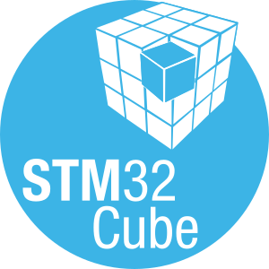

# Welcome to My GitHub Profile!

Hi there! 👋 I'm passionate about coding, learning, and building awesome projects. Here's a little about me:

## About Me
My full name is ``Nguyen Nhat Minh``, you can also call me ``Minh``.

- 🎓 Currently a student at **Ho Chi Minh city of Technology (HCMUT)** - Faculty of **Electrical and Electronics Engineering**.
- 💻 Embedded developer with a focus on **Embedded System, IoT, and Low-level Programing**.
- 🌱 Currently learning [technologies or skills you're learning].
- 🚀 Always excited to collaborate on open-source projects and innovative ideas.

## My Skills
<h4 align="left">Tools:</h4>

    
    
    
    
    
                    

<!-- ## My Projects

Here are some highlights of my work:

- **[Project Name](https://github.com/your-username/project-name)**: A brief description of the project.
- **[Another Project](https://github.com/your-username/another-project)**: A brief description of this project.

Check out my repositories for more! -->

## Get in Touch

- 📫 Reach me at: [nnminh1018@gmail.com](mailto:nnminh1018@gmail.com)
- 💬 Connect with me on [LinkedIn](https://www.linkedin.com/in/smeanuz/)

---

